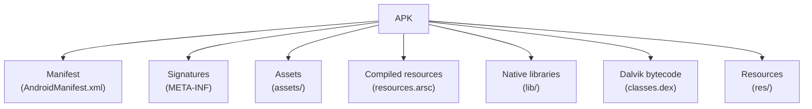

# APK-Static-Toolkit
APK Static Toolkit | Android Package Kit (APK) Analysing Toolkit

**Explanation of the components:**

* **Manifest (AndroidManifest.xml):** Contains essential information about the application, such as its package name, components (activities, services, etc.), permissions, and hardware/software requirements.
* **Signatures (META-INF/):** Directory containing the signature files used to verify the integrity and authenticity of the APK.
* **Assets (assets/):** Directory containing application assets, such as raw data files, that are not compiled into resources.
* **Compiled resources (resources.arsc):** A compiled resource file that indexes and contains all the non-code resources of the application (e.g., strings, layouts, drawables).
* **Native libraries (lib/):** Directory containing compiled code that is specific to a particular device's processor architecture (e.g., .so files).
* **Dalvik bytecode (classes.dex):** Contains the compiled Java code of the application, optimized for the Dalvik or ART (Android Runtime) virtual machine.
* **Resources (res/):** Directory containing the application's resources, such as layouts, drawables (images), strings, and values (colors, dimensions, etc.). These resources are typically compiled into `resources.arsc`.
