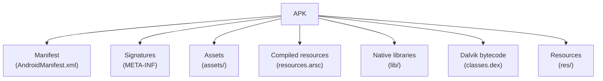
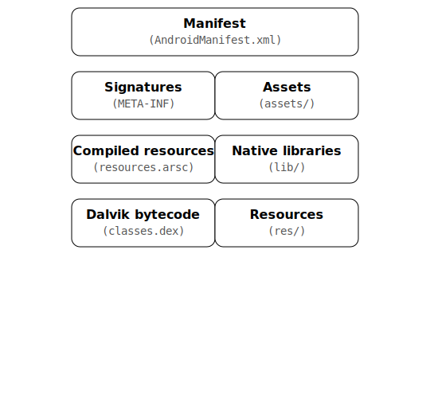

<p align="center">
  
</p>

# **[APK](https://youtube.com/playlist?list=PL9V4Zu3RroiVIEtSO4i4VLlfMJqppvxvh&si=MTyY7rk1Bu5R0ncD) Static Toolkit** | _Android Package Kit (APK) Analysing Toolkit_

[](https://www.python.org/)
[](https://www.android.com/)
[](https://cyberthreatdefence.com/)
[](https://cyberthreatdefence.com/)
<p align="center">
    <a href="https://github.com/cybersecurity-dev/"></a>
    &nbsp;
    <a href="https://www.youtube.com/@CyberThreatDefence"></a>
    &nbsp;
    <a href="https://cyberthreatdefence.com/my_awesome_lists"></a>
    
</p>

<details>
 
 <summary>Install required tools on Linux</summary>
 
 ### For Ubuntu 18.04, 20.04, 22.04
 
 ```bash
 sudo apt-get update
 ```
 </details>
 
 
 <details>
 
 <summary>Install required python libs</summary>
 
 ### pip install
 ```bash
 pip install -r requirements.txt
 python3 setup.py install
 ```
 
 ### conda install
 ```bash
 conda config --add channels conda-forge
 conda install --file requirements_conda.txt
 python3 setup.py install
 ```
 
 </details>

 


**Explanation of the components:**

* **Manifest (AndroidManifest.xml):** Contains essential information about the application, such as its package name, components (activities, services, etc.), permissions, and hardware/software requirements.
* **Signatures (META-INF/):** Directory containing the signature files used to verify the integrity and authenticity of the APK.
* **Assets (assets/):** Directory containing application assets, such as raw data files, that are not compiled into resources.
* **Compiled resources (resources.arsc):** A compiled resource file that indexes and contains all the non-code resources of the application (e.g., strings, layouts, drawables).
* **Native libraries (lib/):** Directory containing compiled code that is specific to a particular device's processor architecture (e.g., .so files).
* **Dalvik bytecode (classes.dex):** Contains the compiled Java code of the application, optimized for the Dalvik or ART (Android Runtime) virtual machine.
* **Resources (res/):** Directory containing the application's resources, such as layouts, drawables (images), strings, and values (colors, dimensions, etc.). These resources are typically compiled into `resources.arsc`.
<p align="center" href="https://www.android.com/"> 
<a href="https://www.android.com/"><picture></picture></a>
</p>
